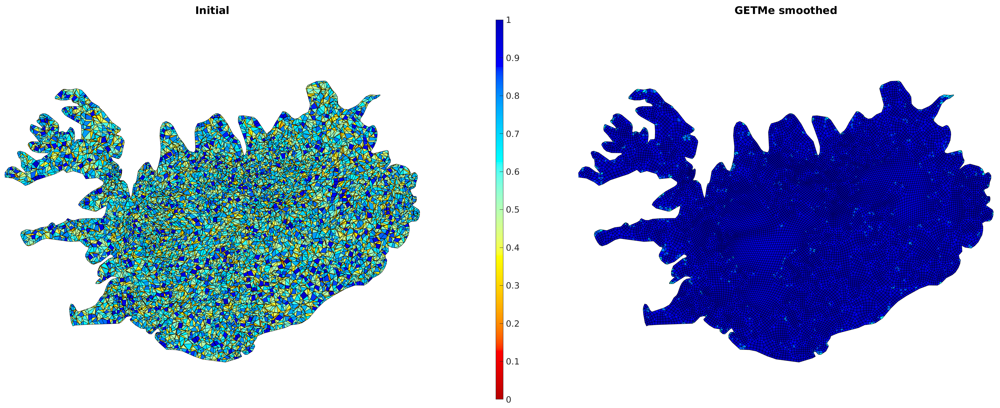

# GETMe Polygonal Meshes 2D

## Introduction

The geometric element transformation method (GETMe) is a smoothing method to improve the quality of polygonal and polyhedral meshes of all types (planar, surface, volumetric, structured, unstructured, anisotropic, etc.). It is based on regularizing polygon and polyhedral transformations, which represent the driving force behind this smoothing approach resulting in high mesh qualities similar to those achieved by applying global optimization based smoothing methods but requiring significantly less computational effort. The implementation provided by this repository is based on the description given in the book [Dimitris Vartziotis and Joachim Wipper. The GETMe Mesh Smoothing Framework: A Geometric Way to Quality Finite Element Meshes. CRC Press. 2018](https://doi.org/10.1201/9780429399626), denoted as the GETMe book in the following.

  

Image: Zoom to Iceland in distorted initial and GETMe smoothed Europe mesh with polygons colored by their mean ratio quality number. Cf. smoothing example [EuropeMesh](./Cpp/Examples/EuropeMesh/) and Section 7.1.1 of the [GETMe book](https://doi.org/10.1201/9780429399626).

This project provides exemplary implementations of the following smoothing algorithms for planar polygonal meshes as described in the Chapters 4 and 6 of the [GETMe book](https://doi.org/10.1201/9780429399626):

- **Basic Laplacian smoothing:** Laplacian smoothing computing node updates by neighbor node averaging. Uses a geometric termination criterion and is also suitable for invalid mesh smoothing.
- **Smart Laplacian smoothing:** Laplacian smoothing with quality based node updates and termination. Requires a valid initial mesh.
- **Basic GETMe simultaneous smoothing:** Smoothing based on regularizing element transformations and a geometric termination criterion. Suitable for invalid mesh smoothing.
- **GETMe simultaneous smoothing:** Quality controlled simultaneous smoothing based on regularizing element transformations using a quality based termination criterion. Geared towards improving the overall mesh quality. Requires a valid initial mesh.
- **GETMe sequential smoothing:** Quality controlled iterative smoothing of the worst quality element using a quality based selection and termination criterion. Geared towards improving the lowest quality elements of the mesh. Requires a valid initial mesh.
- **GETMe smoothing:** Combination of both, GETMe simultaneous and GETMe sequential smoothing. Geared towards improving the overall mesh quality as well as the lowest quality elements. Requires a valid initial mesh.

The mean ratio quality criterion is used for mesh validity and quality assessment. Cf. Section 2.3.2 of the [GETMe book](https://doi.org/10.1201/9780429399626).

## Project Structure

|Directory|Description|
|--|--|
|[Cpp](./Cpp/)|C++ source code of the mesh smoothing project based on the [C++20 standard](https://en.cppreference.com/w/cpp/20). Compilation has been tested with GCC version 12.1 and MSVC version 19.34 on Windows and Linux operating systems, respectively.|
|[Images](./Images/)|Images of the meshes provided and figures used in this document.|
|[Matlab](./Matlab/)|Helper functions to load and visualize meshes using [Matlab](https://mathworks.com/products/matlab.html) or [GNU Octave](https://octave.org/). Functions have been tested with Matlab version 2021a and Octave version 6.4.0. It is recommended to use ```addpath``` to add this directory to your Matlab/Octave search path.|
|[Meshes](./Meshes/)|Meshes for demonstration and testing purposes.|

## How to Start

The C++ project is based on CMake and can thus easily be build for different operating systems and compiler combinations. Please consult the [CMake documentation](https://cmake.org/cmake/help/latest/index.html) for detailed build instructions.

The directory [Cpp/Examples](./Cpp/Examples) contains projects demonstrating the application of Laplacian smoothing and GETMe smoothing to the meshes given in [Meshes](./Meshes) directory. These CMake projects and the resulting executables are named ```example_*```.

Examples overview:

- [Platonic meshes](./Cpp/Examples/PlatonicMeshes/): Random distortion and smoothing of different Platonic meshes using basic Laplacian smoothing and basic GETMe simultaneous smoothing as described in Section 6.1.1 of the [GETMe book](https://doi.org/10.1201/9780429399626).
- [Europe mesh](./Cpp/Examples/EuropeMesh/): Smoothing of a large scale mixed mesh of parts of Europe as described in Section 7.1.1 of the [GETMe book](https://doi.org/10.1201/9780429399626).
- [Gear meshes](./Cpp/Examples/GearMeshes/): Smoothing of a triangular and a quadrilateral finite element mesh of an involute gear as described in Section 7.4.2 of the [GETMe book](https://doi.org/10.1201/9780429399626).

## Mesh files

The meshes given in the directory [Meshes](./Meshes) are stored in a simple ASCII based format. Reading and writing is supported by the functions ```Mesh::readMeshFile``` and ```Mesh::writeMeshFile``` of [polygonal_mesh_algorithms.h](./Cpp/Mesh/Include/Mesh/polygonal_mesh_algorithms.h). The following displays the content of the mesh file [simple_mixed_planar_polygonal.mesh](./Meshes/simple_mixed_planar_polygonal.mesh). Here, omitted parts are indicated by "...":

```text
planar_polygonal_mesh
nodes 11
+0.00000000000000000e+00 +0.00000000000000000e+00
+5.00000000000000000e+00 -1.00000000000000000e+00
+7.00000000000000000e+00 -2.00000000000000000e+00
...
polygons 7
3 0 1 10
3 1 9 10
5 1 2 3 4 9
...
fixed_node_indices 9
0
1
2
...
polygon_mean_ratio_quality_numbers 7
+6.29836657297773606e-01
+9.89743318610787237e-01
+9.14163448527699041e-01
...
```

The mesh file consists of the following blocks:

- **planar_polygonal_mesh**: mesh type keyword.
- **nodes**: followed by the number of nodes and data lines of node x- and y-coordinates each.
- **polygons**: followed by the number of polygons and data lines for the polygons. Each polygon data line starts with the number of nodes and the zero based node indices of that polygon.
- **fixed_node_indices**: followed by the number of fixed nodes and data lines of one fixed node index each. Fixed node coordinates will not be modified by the smoothing algorithms.
- **polygon_mean_ratio_quality_numbers** (optional): followed by the number of mean ratio numbers and data lines containing one quality number each. The k-th entry represents the quality of the k-th polygon.

In the given example, the mesh consists of 11 nodes and 7 polygons. The first polygon is a triangle with node indices 0, 1, 10. The third polygon is a pentagon with node indices 1, 2, 3, 4, 9. Nine of the 11 nodes are fixed. The following image depicts this mesh with polygons colored by their mean ratio quality number. Fixed nodes are marked red, non fixed nodes are marked black.

  

## License (Open Source & Commercial)

Copyright (C) 2023  [TWT GmbH Science & Innovation](https://twt-innovation.de/)

GETMe Polygonal Meshes 2D is licensed under the GNU General Public License v3.0 or later. See [COPYING](./COPYING).

In cases where the constraints of the Open Source license prevent you from using this programm, you can buy a commercial license for GETMe Polygonal Meshes 2D from TWT GmbH. The commercial offer is adapted to academic/research and industry customers.

## Third Party Code Used

The following third party code is used by the C++ implementation given in the directory [Cpp](./Cpp):

|Name / Link|Version|License|Description|
|--|--|--|--|
|[Google Test](https://github.com/google/googletest)|1.13.0|BSD 3-Clause|Unit testing library for C++|
